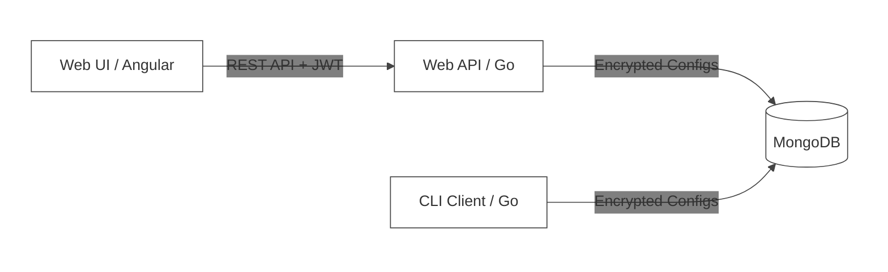
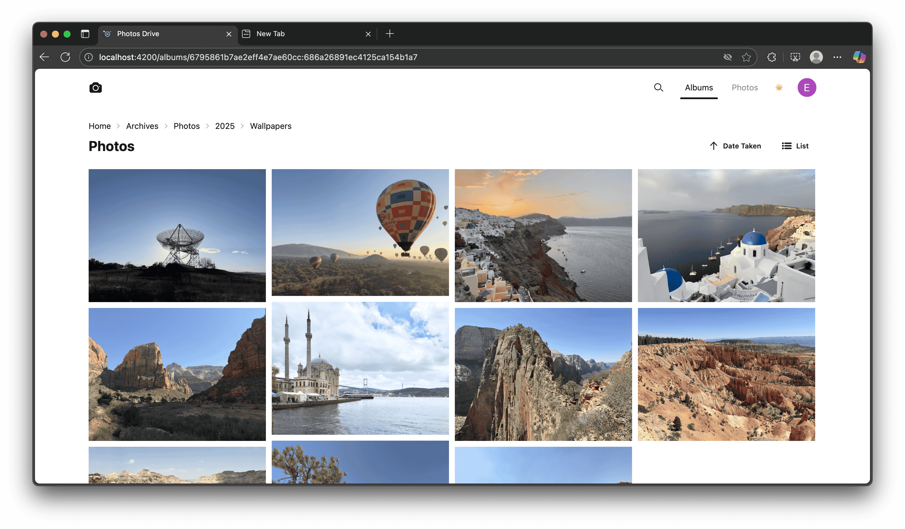
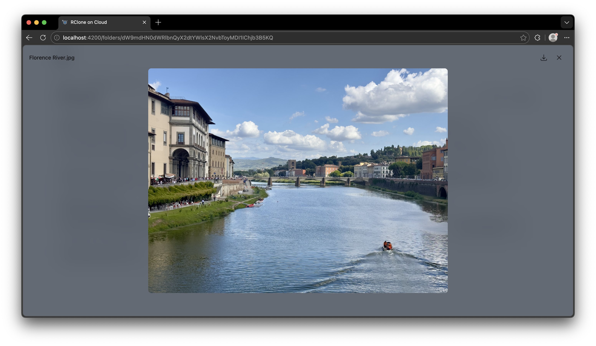
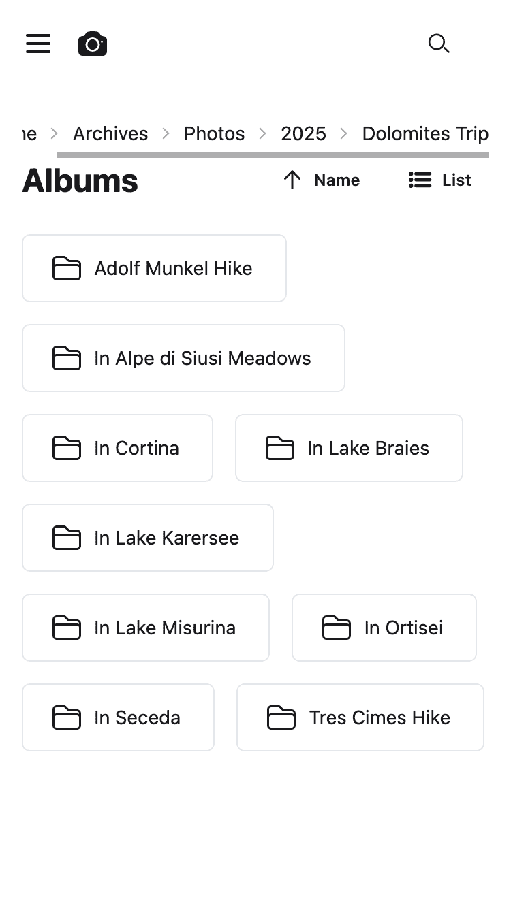

# RClone-on-Cloud

### Description

The **RClone-on-Cloud** project aims to provide a secure, scalable, and stateless web service for [rclone](https://rclone.org/). It stores the rclone configuration files in a secure, centralized MongoDB storage, encrypted with AES-256-GCM and authenticated with a Google OAuth2 + JWT gateway.

The RClone-on-Cloud project is a full stack web development project. It is comprised of several components: the **Web API**, **Web UI**, and the **CLI Client**.

### Table of Contents

- Walkthrough
- Installation
- Usage
- Credits
- License

### Walkthrough of this project

This project consists of several components, each responsible for performing a certain task to manage your cloud configurations securely. The diagram below illustrates the system architecture of the project.



Users can use the front-end web application to browse their cloud files and manage their remotes directly from their browser.

<div width="100%">
    <p align="center">

    </p>
</div>

The application includes an image viewer to easily preview your media stored on the cloud.

<div width="100%">
    <p align="center">
    
    </p>
</div>

It also provides a mobile-responsive interface for managing your files on the go.

<div width="100%">
    <p align="center">

    </p>
</div>

### Installation

##### Required Programs and Tools:

- Go 1.25+
- Node.js & npm
- MongoDB 7.0+ (Local or Atlas)

##### Set up the database

- Install MongoDB on your machine or use a MongoDB Atlas instance.
- Create a new database (default name: `rclone`) and a collection (default name: `configs`).
- Ensure you have a valid connection string (e.g., `mongodb://localhost:27017`).

##### Set up the Web API:

- Navigate to the `apps/web-api` directory.
- Create a `.env` file and set the following environment variables:
  - `RCLONE_CONFIG_MONGO_KEY`: A 32-character encryption key.
  - `RCLONE_CONFIG_MONGO_URI`: Your MongoDB connection URI.
  - `AUTH_GOOGLE_CLIENT_ID` / `AUTH_GOOGLE_CLIENT_SECRET`: Your Google Cloud OAuth2 credentials.
- Generate an RSA or Ed25519 key pair for JWT signing and add the PEM strings to your `.env` (refer to the [Web API README](./apps/web-api/README.md) for details).
- Download dependencies and run the API:
  ```bash
  go mod download
  go run .
  ```

##### Set up the Web UI:

- Navigate to the `apps/web-ui` directory.
- Install the project's dependencies:
  ```bash
  npm install
  ```
- Create a `.env` file to store your API endpoints:
  ```text
  NG_APP_LOGIN_URL=http://localhost:3000/auth/v1/google
  NG_APP_WEB_API_ENDPOINT=http://localhost:3000
  ```
- Run the development server:
  ```bash
  npm run dev
  ```

##### Set up the CLI:

- Navigate to the `apps/cli` directory.
- Build the binary locally:
  ```bash
  go build -o rclone-cloud .
  ```
- Configure your environment variables (`MONGO_URL` and `MONGO_KEY`) to match those used by the Web API.

### Usage

Please note that this project is used for educational purposes and is not intended to be used commercially. We are not liable for any damages/changes done by this project.

### Credits

Emilio Kartono, who made the entire project.

### License

This project is protected under the GNU licence. Please refer to the [LICENSE](./LICENSE) for more information.
